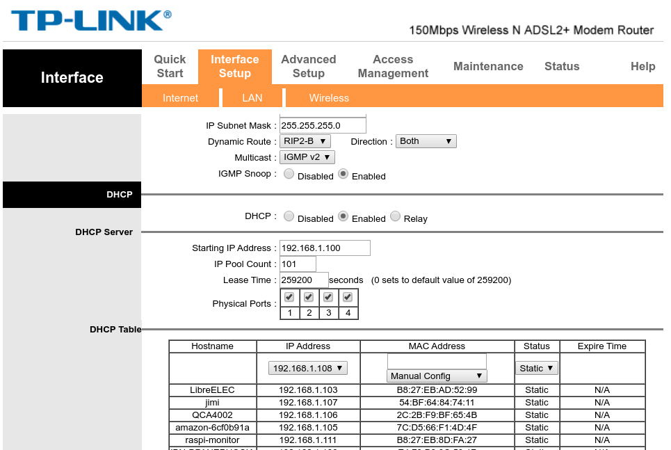
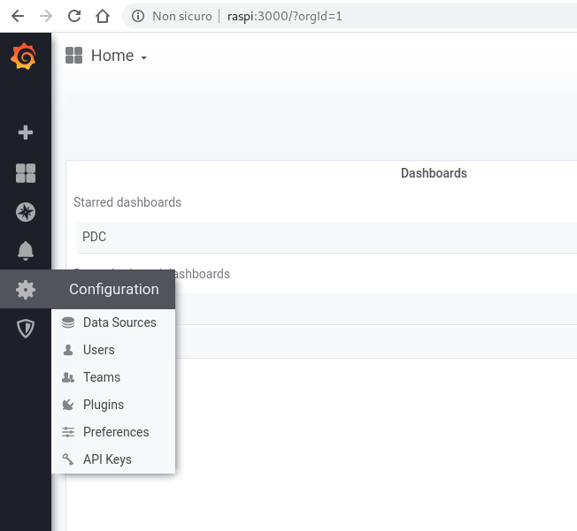
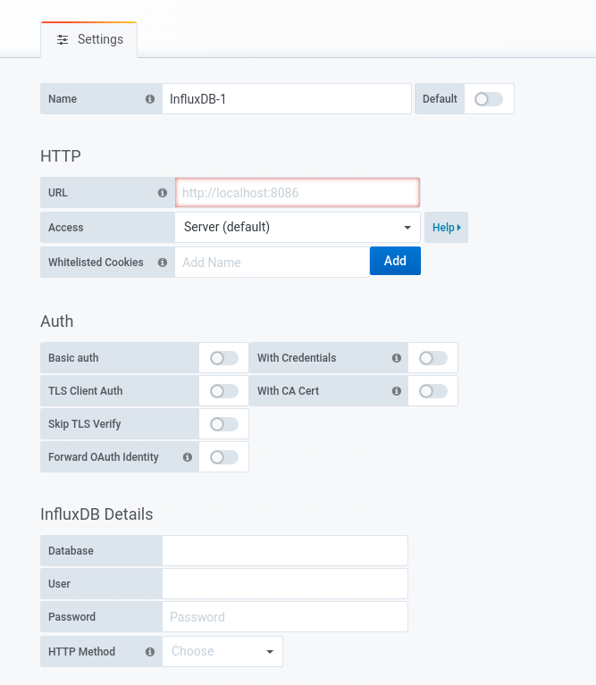
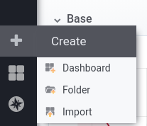
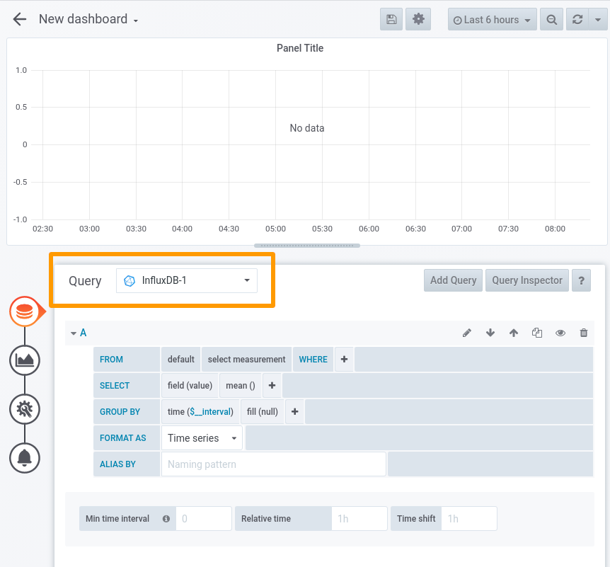
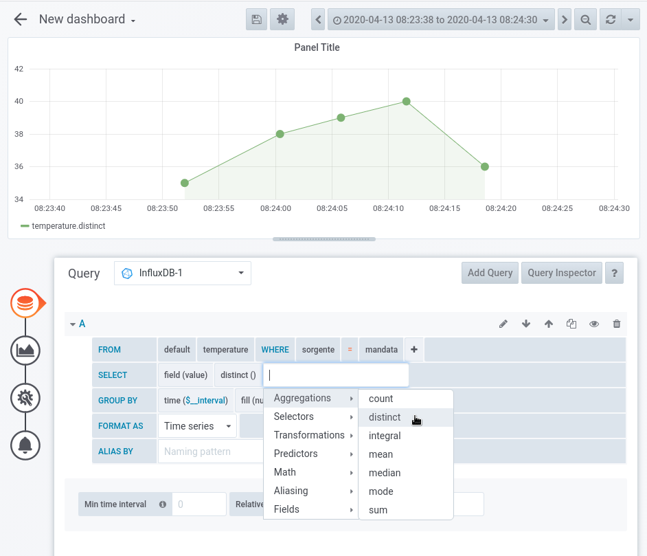

# ENERGETIC(A)MBIENTE

Come requisito per questa breve guida supponiamo di avere una installazione Raspbian funzionante ed in rete (locale/LAN o WAN) e relativo indirizzo IP.

Supponendo che il vostro Raspi sia attivo h24 (e debba restarci) è preferibile associargli un indirizzo IP statico anziché lasciarlo in balia del router e fargli assegnare un indirizzo diverso ogni volta che il vostro lease scade perché magari avete lasciato spento il raspi per troppo tempo per un motivo o per un altro.

Io ho un TP-LINK e la pagina di configurazione è la seguente. Il ```raspi-monitor``` è l'ultimo della lista con un ip statico 192.168.1.111.

<pre>

</pre>

## DNS locale (una semplificazione utile)

Chi si connette da una macchina linux (ma credo anche su winzozz ci sia l'analogo) può andare ad aggiungere, subito dopo la prima riga del file ```/etc/hosts```, questa:

```
192.168.1.111   raspi
```

in modo da avere nel file qualcosa di simile (questo è il file del mio PC)

```
127.0.0.1	localhost localhost.localdomain debian
192.168.1.111   raspi

# The following lines are desirable for IPv6 capable hosts
::1     localhost ip6-localhost ip6-loopback
ff02::1 ip6-allnodes
ff02::2 ip6-allrouters
```

Così facendo possiamo connetterci al nostro Raspi (sia da browser che attraverso ssh) usando 

```
ssh pi@raspi
```

Anziché sgranare ogni volta tutto l'indirizzo Ip.

Chiaramente potete usare un *alias* (in realtà è il DNS locale) qualsiasi a posto di ```raspi``` ;-)

# Note

Tutti i comandi che seguiranno si suppone vengano lanciati usando un utente non privilegiato, che su una installazione Raspberry è comunemente l'utente **pi**.
Le parti in grigetto del codice rappresentano commenti (tutto ciò che segue il simbolo #) e possono pertanto essere copiati ed incollati per intero insieme alla parte dei comandi veri e propri. Non verranno eseguiti.

Le parti in grigetto che contegono comandi (in alcuni commenti sono stati inseriti) possono essere utilizzate come indicato.

# Installazione pacchetti

```bash
sudo apt update
sudo apt upgrade -y
```

## Influx

Iniziamo con l'informare il sistema di gestione dei pacchetti (APT) che andremo ad utilizzare le repo influx ed aggiungiamo quindi la chiave corrispondente con un *oneliner*. 

(*wget* dovrebbe essere presente di default, in caso contrario caso dovrete installarlo ```apt-get -y install wget```)

```sh
wget -qO- https://repos.influxdata.com/influxdb.key | sudo apt-key add -
```
Provvediamo ad inserire le repo del nostro sistema operativo (versione esatta corrente) nei relativi file di configurazione APT

```sh
source /etc/os-release # in questo modo rendiamo disponibili le informazioni sul sistema nella shell su cui stiamo lavorando
# se volete curiosare usate cat /etc/os-release, non fa male :)

echo "deb https://repos.influxdata.com/debian $(lsb_release -cs) stable" | sudo tee /etc/apt/sources.list.d/influxdb.list
```

se volete curiosare e vedere cosa avete aggiunto al file influxdb.list lanciate solo la prima parte del comando (quella prima del pipe "|"")

```sh
echo "deb https://repos.influxdata.com/debian $(lsb_release -cs) stable"
```

Aggiorniamo le repo ed installiamo Influx

```
sudo apt update
sudo apt install influxdb
```

Adesso è il momento di abilitare Influx come servizio all'avvio e farlo partire per il resto della guida.

```bash
sudo systemctl unmask influxdb
sudo systemctl enable influxdb

sudo systemctl start influxdb
```

## Connessione ad InfluxDB 

Per connetterci ad Influx dobbiamo usare l'interfaccia a riga di comando (CLI da ora in poi) e visto che siamo sul nostro Raspi è sufficiente lanciare il comando che segue, senza preoccuparci di specificare *host*, *utente* (ed eventualmente porta, se diversa da quella di default). 

Quindi 
```
influx
```

siamo dentro.

## Primo database

Per creare un database in influx è sufficente lo standard SQL quindi basta semplicemente usare la sintassi:

<pre>CREATE DATABASE <DBNAME></pre>

Iniziamo a chiamare le cose con il proprio nome quindi il nostro primo database si chiamerà PDC,

```sql
CREATE DATABASE PDC
```

altro passaggio, anch'esso comune a tutti i db manager, è quello di istruire influx su quale db stiamo operando. Lo facciamo con il comando ```USE```


```sql
USE PDC
```

## Breve intro su InfluxDB

InfluxDB organizza i dati in serie storiche (time series o misure) in cui ogni punto della serie rappresenta una un campione.

Un punto (data point) consiste di: 

- tempo 
- nome della misura
- uno o più valori

Si possono utilizzare anche dei *tags* che sono sostanzialmente stringhe di testo che vengono utilizzate come indici per ottimizzare le ricerche.

Il tempo rappresenta la cosidetta chiave primaria (primary key), la misura la tabella ed i tags e campi sono le colonne.

In sede di inserimento dati non è necessario specificare il tempo (timestamp) a meno che non si abbia la necessità di usarne uno diverso da quello di sistema (ad esempio per caricare dati storici).

Il formato di un data point è quindi

```
<measurement>[,<tag-key>=<tag-value>...] <field-key>=<field-value>[,<field2-key>=<field2-value>...] [unix-nano-timestamp]
```

Per approfondimenti si rimanda alla [documentazione ufficiale](https://docs.influxdata.com/influxdb/v1.7/).

## Creazione tabella (misura) ed inserimento dati

Per lo scopo di questo tutorial avremo bisogno di inserire dati di temperatura per mandata, ritorno e temperatura esterna. Quindi per quanto detto in precedenza useremo come nome della misura "temperature", un tag "sorgente" e come nome di campo "value".

Quindi

```sql
INSERT temperature,sorgente=mandata value=20
```

Quindi per inserire ulteriori punti

```sql
INSERT temperature,sorgente=mandata value=35
INSERT temperature,sorgente=ritorno value=33
INSERT temperature,sorgente=esterna value=18
```


## Utilizzo della clausola "SELECT"

To start with, you can retrieve all data from a measurement by using a command like below. This command will grab all fields and keys from the specified measurement.

```sql
SELECT * FROM temperature
```

Using that command with our sample data you should get a result like we have below.

```
SELECT * FROM temperature
name: temperature
time                sorgente    value
----                --------    -----
1586749433336403281 mandata     20
1586749435859176782 mandata     35
1586749438114881978 ritorno     33
1586749440223591274 esterna     18
```

## Utilizzo della clausola "WHERE"

Per selezionare soltanto la temperatura di mandata basta procedere nel modo canonico usana una SELECT associata alla condizione WHERE specificando i tag o campi di cui vogliamo il valore.

Come detto in precedenza i *tag* sono considerati come stringhe pertanto quando vengono utilizzati come termini di ricerca devono essere racchiusi tra apici singoli.


```sql
SELECT value FROM temperature WHERE sorgente='mandata'
```

```
name: temperature
time                value
----                -----
1586749433336403281 20
1586749435859176782 35
```

Abbiamo ottenuto le sole temperature di mandata.


## Autenticazione

Utilizzare credenziali di autenticazione è sempre una buona prassi, anche per installazioni locali. 

Come primo passo creiamo un utente amministratore quindi utilizziamo Influx dalla riga di comando (CLI) 

```sh
influx
```

e lanciamo questo comando, sostituendo a ```<password>``` una stringa complicata "quanto necessario". Per installazioni in rete locale privata si può usare una stringa semplice, se un futuro il servizio verrà esposto all'esterno allora sarà necessario aumentare il livello di complessità.

```sql
CREATE USER admin WITH PASSWORD '<password>' WITH ALL PRIVILEGES
```

Il nome dell'utente amministratore è arbitrario e non deve essere necessariamente ```admin```.

Creiamo adesso un utente per Grafana che abbia i privilegi di sola lettura (sempre per buona prassi)
```sql
CREATE USER grafana WITH PASSWORD '<password-super-segreta>'
GRANT READ ON PDC TO grafana;
```

# Grafana

Again we need to add the Grafana packages to apt:

```sh
wget -q -O - https://packages.grafana.com/gpg.key | sudo apt-key add -
echo "deb https://packages.grafana.com/oss/deb stable main" | sudo tee /etc/apt/sources.list.d/grafana.list
```

Procediamo adesso all'installazione, previo aggiornamento della lista dei pacchetti della nuova repo

```
sudo apt update && sudo apt install -y grafana
```

Il prossimo step è quello di abilitare il servizio all'avvio 

```sh
sudo systemctl unmask grafana-server.service
sudo systemctl start grafana-server
sudo systemctl enable grafana-server.service
```

A questo punto Grafana dovrebbe essere *up and running* ed in ascolto sulla porta di default.

Dalla macchina che userete per connettervi al Raspi aprite il browser e visitate la pagina

http://<indirizzo-ip>:3000

altrimenti potete usare l'alias inserito in precedenza sostituendo *<indirizzo-ip>* con quello che avete scelto. Nel mio caso 

```
http://raspi:3000
```

Seguite quindi le istruzioni per il primo accesso con l'utente di default ```username``` e ```password``` sono ```admin```. Poi cambiate la password a vostro piacimento.


# Aggiungere Influx come *data source*

Autenticarsi, se già non lo siete, in Grafana e cercate "Data Sources", selezionate "Add new Data Source” e scegliete InfluxDB come tipologia.

<pre>

</pre>

<pre>

</pre>

Potete salvare la connessione (lasciate il nome di default oppure cambiatelo a vostro piacimento), Grafana effettuerà un test per voi restituendo un messaggio se la connessione è andata a buon fine. Se tutto è andato liscio siete pronti per il primo grafico.


## Primo grafico

Procediamo ora creando la nostra prima dashboard che sarà il contenitore dove andremo ad inserire in nostri grafici o report etc...
<pre>

</pre>

Dopo aver scelto... "Dashboard" :-) si presenterà questa schermata:

Scegliete "Add Query" vi si presenterà questa pagina. Attenzione al menù a tendina a destra di "Query", quello evidenziato. In quel menù vedrete comparire la sorgente che avete inserito nella sezione precedente, se avete lasciato il nome di default probabilmente sarà semplicemente "InfluxDB", nel mio caso è diversa perché ho già una sorgente con quel nome. 

All'occorrenza potete inserire quanti *data source* volete (anche ad altra tipologia di database chiaramente).

<pre>

</pre>

Per creare un grafico sarà a questo punto sufficente inserire i parametri di interessa nel riquadro in basso, nello specifico: 

- indicare la tabella nella condizione FROM, nel nostro caso "temperature"
- specificare quale *tag* vogliamo utilizzare per il grafico
- cosa vogliamo dalla SELECT (una media, un massimo, il valore in se, etc etc...)

scegliamo il valore nudo e crudo con DISTINCT. 

Il risultato sarà qualcosa di simile se avrete inserito, come ho fatto io, più punti per il *key* (colonna o campo) "mandata" relativo al *tag* "sorgente" (indice)

<pre>

</pre>
