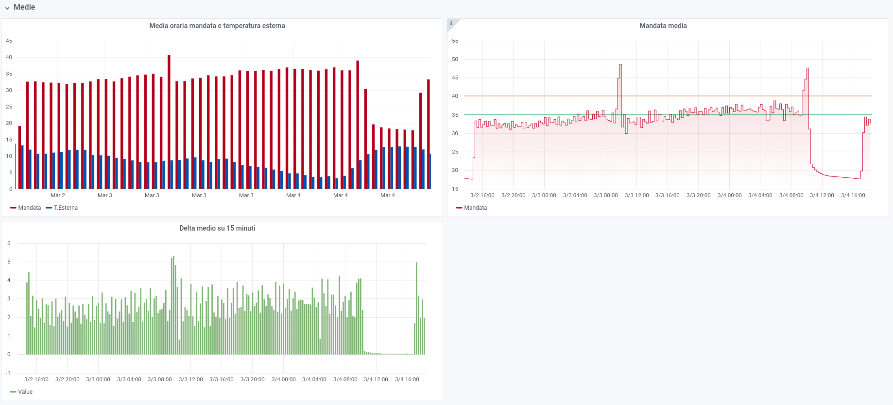

# Grafana

Again we need to add the Grafana packages to apt:

```sh
wget -q -O - https://packages.grafana.com/gpg.key | sudo apt-key add -
echo "deb https://packages.grafana.com/oss/deb stable main" | sudo tee /etc/apt/sources.list.d/grafana.list
```

Procediamo adesso all'installazione, previo aggiornamento della lista dei pacchetti della nuova repo

```
sudo apt update && sudo apt install -y grafana
```

Il prossimo step è quello di abilitare il servizio all'avvio 

```sh
sudo systemctl unmask grafana-server.service
sudo systemctl start grafana-server
sudo systemctl enable grafana-server.service
```

A questo punto Grafana dovrebbe essere *up and running* ed in ascolto sulla porta di default.

Dalla macchina che userete per connettervi al Raspi aprite il browser e visitate la pagina

http://<indirizzo-ip>:3000

altrimenti potete usare l'alias inserito in precedenza sostituendo *<indirizzo-ip>* con quello che avete scelto. Nel mio caso 

```
http://raspi:3000
```

Seguite quindi le istruzioni per il primo accesso con l'utente di default ```username``` e ```password``` sono ```admin```. Poi cambiate la password a vostro piacimento.


# Aggiungere Influx come *data source*

Autenticarsi, se già non lo siete, in Grafana e cercate "Data Sources", selezionate "Add new Data Source” e scegliete InfluxDB come tipologia.

<pre>

</pre>

<pre>

</pre>

Potete salvare la connessione (lasciate il nome di default oppure cambiatelo a vostro piacimento), Grafana effettuerà un test per voi restituendo un messaggio se la connessione è andata a buon fine. Se tutto è andato liscio siete pronti per il primo grafico.


## Primo grafico

Procediamo ora creando la nostra prima dashboard che sarà il contenitore dove andremo ad inserire in nostri grafici o report etc...
<pre>

</pre>

Dopo aver scelto... "Dashboard" :-) si presenterà questa schermata:

Scegliete "Add Query" vi si presenterà questa pagina. Attenzione al menù a tendina a destra di "Query", quello evidenziato. In quel menù vedrete comparire la sorgente che avete inserito nella sezione precedente, se avete lasciato il nome di default probabilmente sarà semplicemente "InfluxDB", nel mio caso è diversa perché ho già una sorgente con quel nome. 

All'occorrenza potete inserire quanti *data source* volete (anche ad altra tipologia di database chiaramente).

<pre>

</pre>

Per creare un grafico sarà a questo punto sufficente inserire i parametri di interessa nel riquadro in basso, nello specifico: 

- indicare la tabella nella condizione FROM, nel nostro caso "temperature"
- specificare quale *tag* vogliamo utilizzare per il grafico
- cosa vogliamo dalla SELECT (una media, un massimo, il valore in se, etc etc...)

scegliamo il valore nudo e crudo con DISTINCT. 

Il risultato sarà qualcosa di simile se avrete inserito, come ho fatto io, più punti per il *key* (colonna o campo) "mandata" relativo al *tag* "sorgente" (indice)

<pre>

</pre>


## Dashboard

Questi sono soltanto due esempi delle dashboard che si possono ottenere.

Di seguito il pannello con mandata e ritorno della PDC e in basso il delta, più a destra mandata e ritorno correnti ed in basso il delta corrente. A seguire i parametri ambientali con andamento di temperatura ed umidità esterna ed in basso i valori istantanei.
<pre>

</pre>

I pannelli possono rappresentare anche aggregazioni.
<pre>

</pre>